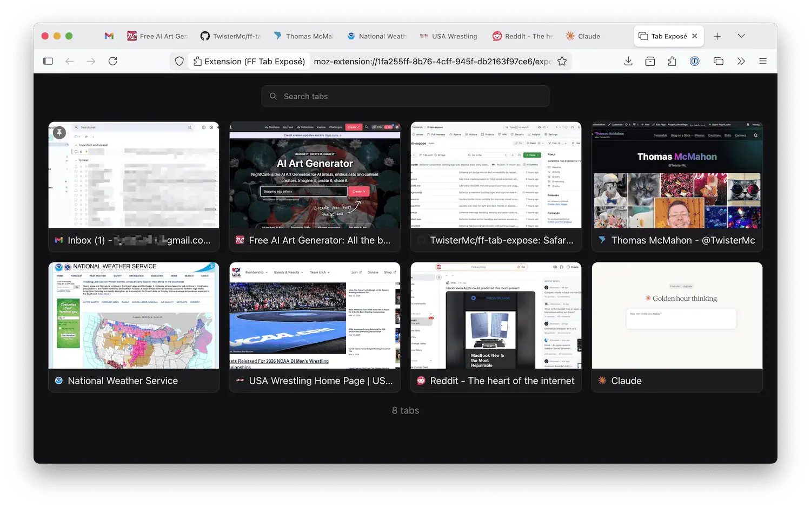

# FF Tab Expose

FF Tab Expose gives you a visual overview of your open Firefox tabs, inspired by Safari-style tab expose.

## What It Does

- Shows all open tabs in a clean visual grid
- Lets you search tabs by title or URL
- Displays tab previews
- Lets you switch or close tabs quickly

## Install

Cominng soon.

If you really want it now, download the code, zip it up, rename it to .xpi and add it to Firefox. You may need to load it via temporary add-on. It'll be up on Firefox Add-ons soon.

## Open Tab Expose

- Click the extension toolbar icon, or
- Use the keyboard shortcut:
  - macOS: `Command+Shift+E`
  - Windows/Linux: `Ctrl+Shift+E`

The shortcut toggles Tab Expose:

- If closed, it opens.
- If already open, it closes.

## Change Keyboard Shortcut

1. Open Firefox Add-ons (`about:addons`).
2. Find **FF Tab Expose**.
3. Open the add-on menu (gear button).
4. Choose **Manage Extension Shortcuts**.
5. Set your preferred shortcut.

## How To Use

- Type in the search box to filter tabs.
- Click a tab card to switch to that tab.
- Click the close button on a card to close that tab.
- Press `Esc` to clear search (or close Expose when search is empty).

## Keyboard Navigation

- `Tab`: Move focus through tab cards
- `Enter` / `Space`: Open focused tab
- `Delete` / `Backspace`: Close focused tab
- `Esc`: Return focus to search (or close Expose)

## Notes About Previews

- Some tabs cannot be captured by Firefox (for example internal pages like `about:`).
- Missing previews are loaded lazily after Tab Expose opens

## Privacy

This add-on reads your open tab information and captures tab previews to render the Expose view.

Preview data is kept in extension memory for runtime use only.

## Donate

If you find FF Tab Expose useful and would like to support its development, consider [making a donation](https://ko-fi.com/twistermc).

Every bit helps and is greatly appreciated!
